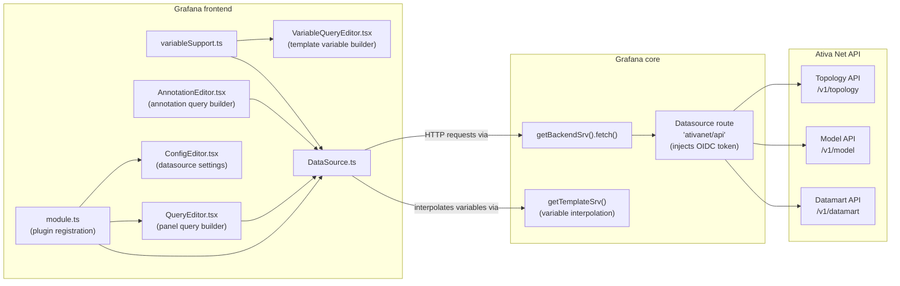
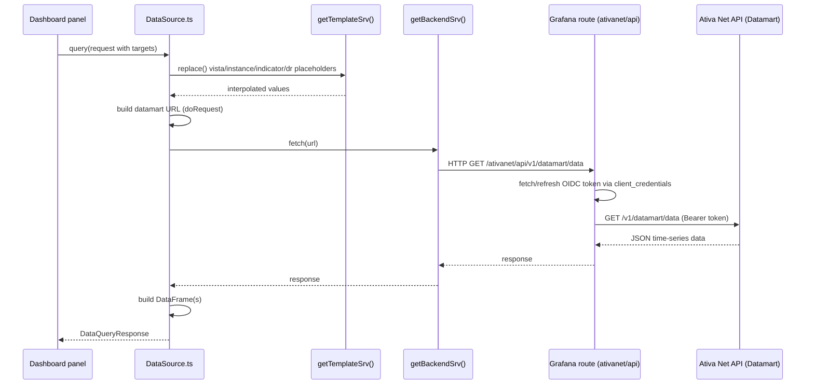

# Developer Onboarding

This document is meant for developers who are new to this project. It explains the purpose of the
plugin, how the codebase is organized, and how to get a local development environment up and running.

For end-user documentation (installation, configuration, usage), see [README.md](README.md).
For the contribution workflow (branching, PRs, releases), see [CONTRIBUTING.md](CONTRIBUTING.md).

## What is this project?

This is a **Grafana data source plugin** for **Infovista Ativa Net** (package name
`infovista-ativanet-datasource`). It lets Grafana dashboards query data from the Ativa Net
platform by talking to the Ativa Net REST API, which in turn exposes:

- **Model**: the vistas, the indicators and properties available for a given Vista.
- **Topology**: the Instances (e.g. devices, interfaces) monitored by Ativa Net.
- **Data**: the display rates (aggregation periods), actual time-series data and events for a given indicator/instance/display rate.

The plugin provides:

- A **query editor** so users can pick a Vista, Instance, Indicator, Display Rate and optional
  property filters when building a panel query.
- A **variable query editor** so dashboard template variables can be backed by Ativa Net topology
  objects (vistas, instances, display rates, "child instances").
- An **annotation editor/support** so Ativa Net events can be displayed as annotations on a
  dashboard timeline.
- A **config editor** for setting up the connection to Ativa Net (URL + OpenID Connect client
  credentials), since authentication to the Ativa Net API is done via OIDC client-credentials flow,
  proxied through a Grafana datasource **route** (see `src/plugin.json`) so the client secret never
  reaches the browser.

Because this is a Grafana plugin, it's built on top of the standard Grafana plugin tooling
(`@grafana/create-plugin` scaffolding): webpack/rspack build, Jest tests, ESLint/Prettier, and a
docker-compose setup to run Grafana locally with the plugin loaded.

## Architecture

### Components overview

The diagram below shows how the plugin's building blocks relate to each other, and how they talk
to the Ativa Net API through the Grafana-managed route.



### Panel query sequence

This sequence shows what happens when a dashboard panel using this datasource refreshes.



## Project structure

```
.
├── src/                        # Plugin source code (TypeScript/React)
│   ├── module.ts                # Plugin entry point: registers the DataSource, ConfigEditor, QueryEditor
│   ├── plugin.json               # Plugin manifest (id, name, routes, included demo dashboards, etc.)
│   ├── types.ts                  # Shared TypeScript types (MyQuery, MyDataSourceOptions, ...)
│   ├── DataSource.ts             # Core datasource class: query(), metricFindQuery(), annotations, HTTP calls
│   ├── ConfigEditor.tsx          # UI for configuring the datasource (URL, OIDC client id/secret)
│   ├── QueryEditor.tsx           # UI for building a panel query (vista/instance/indicator/dr/properties)
│   ├── VariableQueryEditor.tsx   # UI for building a template variable query
│   ├── AnnotationEditor.tsx      # UI for building an annotation query
│   ├── variableSupport.ts        # Wires VariableQueryEditor + metricFindQuery into Grafana's variable system
│   ├── dr.ts                     # Mapping between ISO8601 display-rate codes and human-readable text
│   ├── dashboards/               # Demo dashboards bundled with the plugin (referenced in plugin.json "includes")
│   └── images/                   # Screenshots used in README.md and plugin.json
│
├── .config/                    # Grafana-scaffolded build/tooling config (do not edit directly, see below)
│   ├── webpack/                  # Webpack config used by `yarn build` / `yarn dev`
│   ├── rspack/                   # Alternative rspack config/plugins
│   ├── jest*.js                  # Base Jest config
│   ├── eslint.config.mjs         # Base ESLint config
│   ├── docker-compose-base.yaml  # Base compose file used to run Grafana locally with this plugin
│   ├── Dockerfile / entrypoint.sh / supervisord/  # Used to build the local dev Grafana docker image
│   └── README.md                 # Explains how to safely extend each of the above configs
│
├── provisioning/                # Grafana provisioning files used by the local docker-compose Grafana instance
├── docker-compose.yaml          # Root compose file, extends .config/docker-compose-base.yaml
├── dist/                        # Build output (generated, checked in for release purposes)
├── jest.config.js / jest-setup.js  # Root Jest config, extends .config/jest.config.js
├── tsconfig.json                # Root TypeScript config, extends .config/tsconfig.json
├── package.json                 # Scripts and dependencies
├── CHANGELOG.md                 # Release history
├── CONTRIBUTING.md              # Contribution workflow
├── README.md                    # End-user facing documentation
└── README-dev.md                # This file: developer onboarding
```

### Key source files in detail

- **`src/DataSource.ts`** — the heart of the plugin. It extends `DataSourceApi` and implements:
  - `query()` — builds the datamart URL for each panel target (vista/instance/indicator/display
    rate/properties), calls the API, and turns the response into Grafana `DataFrame`s.
  - `metricFindQuery()` — used by template variables (`vista`, `instance`, `cinstance`, `dr` query
    types) to fetch topology/model data from the API.
  - `getAllVista/getAllInstances/getAllIndicators/getAllProperties/getAllDr` — helpers used
    directly by the `QueryEditor` dropdowns.
  - `annotations` — `AnnotationSupport` object wiring `AnnotationEditor` and event parsing for
    dashboard annotations.
  - `testDatasource()` / `updateRealm()` — used by the "Save & Test" button in the config editor;
    also auto-detects/repairs the OIDC realm setting.
  - All HTTP calls go through `getBackendSrv().fetch()` and are routed via the `ativanet/api` route
    declared in `src/plugin.json`, which injects the OIDC bearer token server-side.

- **`src/types.ts`** — shared types: `MyQuery` (panel query shape), `MyDataSourceOptions` /
  `MySecureJsonData` (datasource config), `MyVariableQuery` / `MyMetricFindQuery` (variable query
  shape, serialized as a JSON string in the query editor).

- **`src/QueryEditor.tsx`**, **`src/VariableQueryEditor.tsx`**, **`src/AnnotationEditor.tsx`**,
  **`src/ConfigEditor.tsx`** — React components built with `@grafana/ui` components, one per editor
  surface exposed by the plugin.

- **`src/dr.ts`** — small lookup tables converting between the ISO8601-based display rate codes
  used by the API and human-readable labels shown in the UI.

## Prerequisites

- Node.js version pinned in `.nvmrc` (`nvm use`).
- Yarn (this repo uses `yarn@1.22.22`, declared via `packageManager` in `package.json`).
- Docker (to run a local Grafana instance with the plugin loaded).

## Getting started

```sh
nvm use
yarn install
```

### Common scripts (`package.json`)

| Script              | Purpose                                                              |
|---------------------|------------------------------------------------------------------------|
| `yarn dev`          | Build in watch mode (rebuilds on file change) for local development   |
| `yarn build`        | Production build, output goes to `dist/`                              |
| `yarn server`       | `docker compose up --build`: runs a local Grafana with the plugin loaded |
| `yarn test`         | Run Jest tests in watch mode (only changed files)                     |
| `yarn test:ci`      | Run the full Jest suite once (used in CI)                              |
| `yarn e2e`          | Run Playwright end-to-end tests                                       |
| `yarn lint` / `lint:fix` | Run ESLint (and Prettier via `lint:fix`)                          |
| `yarn typecheck`    | Run `tsc --noEmit` to check types without emitting output              |
| `yarn sign`         | Sign the plugin using `@grafana/sign-plugin`                          |

### Typical local dev loop

1. `yarn dev` in one terminal to keep the plugin bundle rebuilt on change.
2. `yarn server` in another terminal to run Grafana locally (via `docker-compose.yaml`, which
   extends `.config/docker-compose-base.yaml`) with the built plugin mounted.
3. Open Grafana (usually http://localhost:3000), add an "Infovista Ativa Net" data source, and
   point it at a real (or test) Ativa Net API instance — see `README.md` for the required OIDC
   client setup on the Ativa Net side.
   > **Note:** the certificate of the Ativa Web Portal is unknown to the local Grafana docker
   > image by default. It should be added to the image (e.g. via the `.config/Dockerfile` /
   > `docker-compose.yaml` setup) so that the container trusts it, otherwise the connection will
   > fail and the datasource will return a `Bad Gateway` error when saving/testing it.
4. Iterate on the code; the webpack watch build plus Grafana's plugin reload (live reload plugin
   configured in `.config/rspack/liveReloadPlugin.js` / webpack config) will pick up changes.

### Tests

- Unit/UI tests use Jest + Testing Library (`.config/jest*`, root `jest.config.js` /
  `jest-setup.js`). Run with `yarn test` (watch) or `yarn test:ci` (CI mode).
- E2E tests use `@grafana/plugin-e2e` + Playwright (`yarn e2e`), driving a real Grafana instance.

## About the `.config/` directory

`.config/` is auto-generated by the Grafana plugin scaffolding tool (`@grafana/create-plugin`) and
should **not** be edited directly, since it can be regenerated/updated by the scaffolding tool.
Instead, root-level files (`tsconfig.json`, `.prettierrc.js`, `jest.config.js`,
`eslint.config.mjs`, `docker-compose.yaml`, ...) extend/merge the base configuration found in
`.config/`. See `.config/README.md` for concrete examples of how to extend each tool's config
(ESLint, Prettier, Jest, TypeScript, Webpack, Docker).

## Plugin manifest (`src/plugin.json`)

This file declares the plugin metadata Grafana needs: id/name, the OIDC-backed API route
(`ativanet/api`), the demo dashboards bundled with the plugin (under `src/dashboards/`), and the
minimum compatible Grafana version. When bumping the plugin version, also check `CHANGELOG.md` and
`package.json`'s `version` field, which are kept in sync as part of the release process.

## Where to look next

- End-user features and configuration steps: [README.md](README.md).
- Contribution/PR process: [CONTRIBUTING.md](CONTRIBUTING.md).
- Release history: [CHANGELOG.md](CHANGELOG.md).
- CI pipeline: `.github/workflows/ci.yml` (lint, typecheck, test, build) and
  `.github/workflows/release.yml`.
